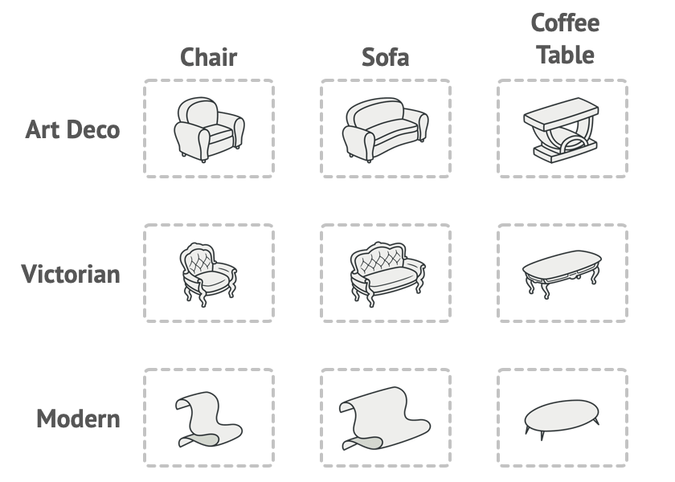
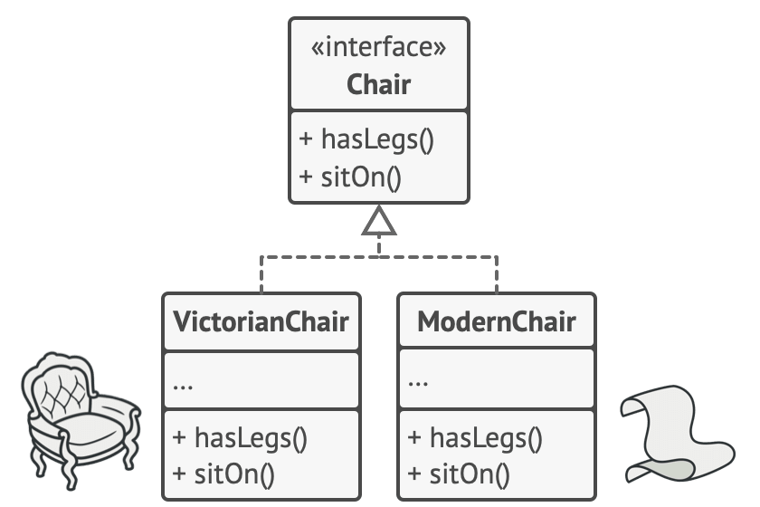
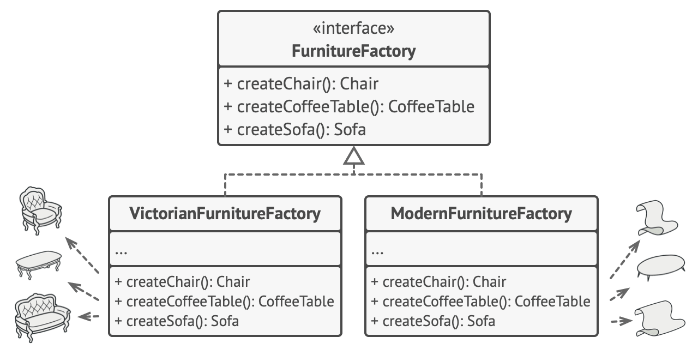
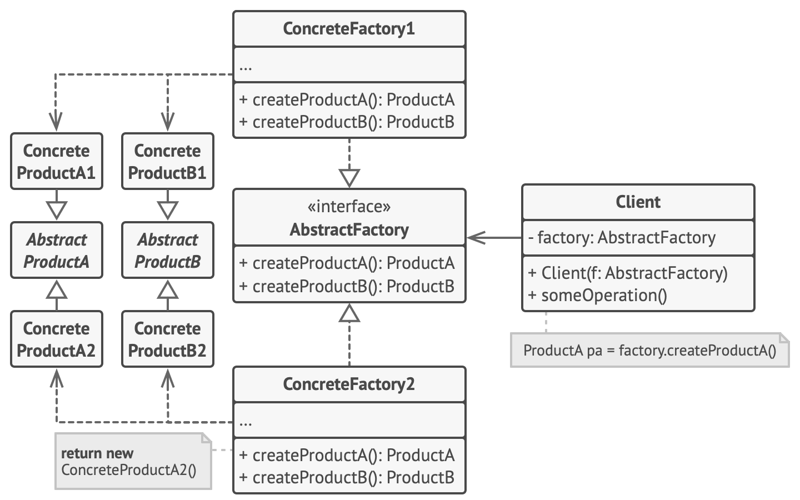

# Abstract Factory Design Pattern
Source: [Abstract Factory Design Pattern](https://refactoring.guru/design-patterns/abstract-factory)

Abstract Factory is a creational design pattern that lets you produce families of related objects without specifying their concrete classes.

## Problem Crux

Imagine that you’re creating a furniture shop simulator. Your code consists of classes that represent:
1. A family of related products, say: ```Chair``` + ```Sofa``` + ```CoffeeTable```.
2. Several variants of this family. For example, products ```Chair``` + ```Sofa``` + ```CoffeeTable``` are available in these variants: ```Modern```, ```Victorian```, ```ArtDeco```.



You need a way to create individual furniture objects so that they match other objects of the same family. Customers get quite mad when they receive non-matching furniture.

Also, you don’t want to change existing code when adding new products or families of products to the program. Furniture vendors update their catalogs very often, and you wouldn’t want to change the core code each time it happens.

## Solution

The first thing the Abstract Factory pattern suggests is to explicitly declare interfaces for each distinct product of the product family (e.g., chair, sofa or coffee table). Then you can make all variants of products follow those interfaces. For example, all chair variants can implement the Chair interface; all coffee table variants can implement the CoffeeTable interface, and so on.



The next move is to declare the Abstract Factory—an interface with a list of creation methods for all products that are part of the product family (for example, ```createChair```, ```createSofa``` and ```createCoffeeTable```). These methods must return abstract product types represented by the interfaces we extracted previously: ```Chair```, ```Sofa```, ```CoffeeTable``` and so on.



Now, how about the product variants? For each variant of a product family, we create a separate factory class based on the  ```AbstractFactory``` interface. A factory is a class that returns products of a particular kind. For example, the ```ModernFurnitureFactory``` can only create ```ModernChair```, ```ModernSofa``` and ```ModernCoffeeTable``` objects.

The client code has to work with both factories and products via their respective abstract interfaces. This lets you change the type of a factory that you pass to the client code, as well as the product variant that the client code receives, without breaking the actual client code.

## Structure



This is main structure of abstract factory design pattern.

1. Abstract Products declare interfaces for a set of distinct but related products which make up a product family.
2. Concrete Products are various implementations of abstract products, grouped by variants. Each abstract product (chair/sofa) must be implemented in all given variants (Victorian/Modern).
3. The Abstract Factory interface declares a set of methods for creating each of the abstract products.
4. Concrete Factories implement creation methods of the abstract factory. Each concrete factory corresponds to a specific variant of products and creates only those product variants.


> Use the Abstract Factory when your code needs to work with various families of related products, but you don’t want it to depend on the concrete classes of those products—they might be unknown beforehand or you simply want to allow for future extensibility.

The Abstract Factory provides you with an interface for creating objects from each class of the product family. As long as your code creates objects via this interface, you don’t have to worry about creating the wrong variant of a product which doesn’t match the products already created by your app.

## Framwork to follow while implementing

1. Map out a matrix of distinct product types versus variants of these products.
2. Declare abstract product interfaces for all product types. Then make all concrete product classes implement these interfaces.
3. Declare the abstract factory interface with a set of creation methods for all abstract products.
4. Implement a set of concrete factory classes, one for each product variant.
5. Create factory initialization code somewhere in the app. It should instantiate one of the concrete factory classes, depending on the application configuration or the current environment. Pass this factory object to all classes that construct products.


```cpp
/**
 * Each distinct product of a product family should have a base interface. All
 * variants of the product must implement this interface.
 */
class AbstractProductA {
 public:
  virtual ~AbstractProductA(){};
  virtual std::string UsefulFunctionA() const = 0;
};

/**
 * Concrete Products are created by corresponding Concrete Factories.
 */
class ConcreteProductA1 : public AbstractProductA {
 public:
  std::string UsefulFunctionA() const override {
    return "The result of the product A1.";
  }
};

class ConcreteProductA2 : public AbstractProductA {
  std::string UsefulFunctionA() const override {
    return "The result of the product A2.";
  }
};

/**
 * Here's the the base interface of another product. All products can interact
 * with each other, but proper interaction is possible only between products of
 * the same concrete variant.
 */
class AbstractProductB {
  /**
   * Product B is able to do its own thing...
   */
 public:
  virtual ~AbstractProductB(){};
  virtual std::string UsefulFunctionB() const = 0;
  /**
   * ...but it also can collaborate with the ProductA.
   *
   * The Abstract Factory makes sure that all products it creates are of the
   * same variant and thus, compatible.
   */
  virtual std::string AnotherUsefulFunctionB(const AbstractProductA &collaborator) const = 0;
};

/**
 * Concrete Products are created by corresponding Concrete Factories.
 */
class ConcreteProductB1 : public AbstractProductB {
 public:
  std::string UsefulFunctionB() const override {
    return "The result of the product B1.";
  }
  /**
   * The variant, Product B1, is only able to work correctly with the variant,
   * Product A1. Nevertheless, it accepts any instance of AbstractProductA as an
   * argument.
   */
  std::string AnotherUsefulFunctionB(const AbstractProductA &collaborator) const override {
    const std::string result = collaborator.UsefulFunctionA();
    return "The result of the B1 collaborating with ( " + result + " )";
  }
};

class ConcreteProductB2 : public AbstractProductB {
 public:
  std::string UsefulFunctionB() const override {
    return "The result of the product B2.";
  }
  /**
   * The variant, Product B2, is only able to work correctly with the variant,
   * Product A2. Nevertheless, it accepts any instance of AbstractProductA as an
   * argument.
   */
  std::string AnotherUsefulFunctionB(const AbstractProductA &collaborator) const override {
    const std::string result = collaborator.UsefulFunctionA();
    return "The result of the B2 collaborating with ( " + result + " )";
  }
};

/**
 * The Abstract Factory interface declares a set of methods that return
 * different abstract products. These products are called a family and are
 * related by a high-level theme or concept. Products of one family are usually
 * able to collaborate among themselves. A family of products may have several
 * variants, but the products of one variant are incompatible with products of
 * another.
 */
class AbstractFactory {
 public:
  virtual ~AbstractFactory(){};
  virtual AbstractProductA *CreateProductA() const = 0;
  virtual AbstractProductB *CreateProductB() const = 0;
};

/**
 * Concrete Factories produce a family of products that belong to a single
 * variant. The factory guarantees that resulting products are compatible. Note
 * that signatures of the Concrete Factory's methods return an abstract product,
 * while inside the method a concrete product is instantiated.
 */
class ConcreteFactory1 : public AbstractFactory {
 public:
  AbstractProductA *CreateProductA() const override {
    return new ConcreteProductA1();
  }
  AbstractProductB *CreateProductB() const override {
    return new ConcreteProductB1();
  }
};

/**
 * Each Concrete Factory has a corresponding product variant.
 */
class ConcreteFactory2 : public AbstractFactory {
 public:
  AbstractProductA *CreateProductA() const override {
    return new ConcreteProductA2();
  }
  AbstractProductB *CreateProductB() const override {
    return new ConcreteProductB2();
  }
};

/**
 * The client code works with factories and products only through abstract
 * types: AbstractFactory and AbstractProduct. This lets you pass any factory or
 * product subclass to the client code without breaking it.
 */

void ClientCode(const AbstractFactory &factory) {
  const AbstractProductA *product_a = factory.CreateProductA();
  const AbstractProductB *product_b = factory.CreateProductB();
  std::cout << product_b->UsefulFunctionB() << "\n";
  std::cout << product_b->AnotherUsefulFunctionB(*product_a) << "\n";
  delete product_a;
  delete product_b;
}

int main() {
  std::cout << "Client: Testing client code with the first factory type:\n";
  ConcreteFactory1 *f1 = new ConcreteFactory1();
  ClientCode(*f1);
  delete f1;
  std::cout << std::endl;
  std::cout << "Client: Testing the same client code with the second factory type:\n";
  ConcreteFactory2 *f2 = new ConcreteFactory2();
  ClientCode(*f2);
  delete f2;
  return 0;
}
```

```
Client: Testing client code with the first factory type:
The result of the product B1.
The result of the B1 collaborating with the (The result of the product A1.)

Client: Testing the same client code with the second factory type:
The result of the product B2.
The result of the B2 collaborating with the (The result of the product A2.)
```

## Pros

 - Single Responsibility Principle. You can extract the product creation code into one place, making the code easier to support.
 - Open/Closed Principle. You can introduce new variants of products without breaking existing client code.
 - You can be sure that the products you’re getting from a factory are compatible with each other.

## How is it different from Factory Design pattern

 - ```Factory``` create one Product and one Factory and their sub classes, whereas ```Abstract Factory``` creates family of related product and concreateCreator Classes (factories) which creates related product family objects.

### When to use what:
 - Use Factory Method when:
    - You need to delegate object creation to subclasses
    - Only one product hierarchy involved
 - Use Abstract Factory when:
    - Products must be used together
    - You need consistency among related objects
    - You want to switch entire product families at once

## Real-World Example:
 - Factory Method → Logger factory creating ```FileLogger``` or ```DBLogger```
 - Abstract Factory → Database factory creating ```Connection```, ```Command```, ```Transaction``` for MySQL vs PostgreSQL