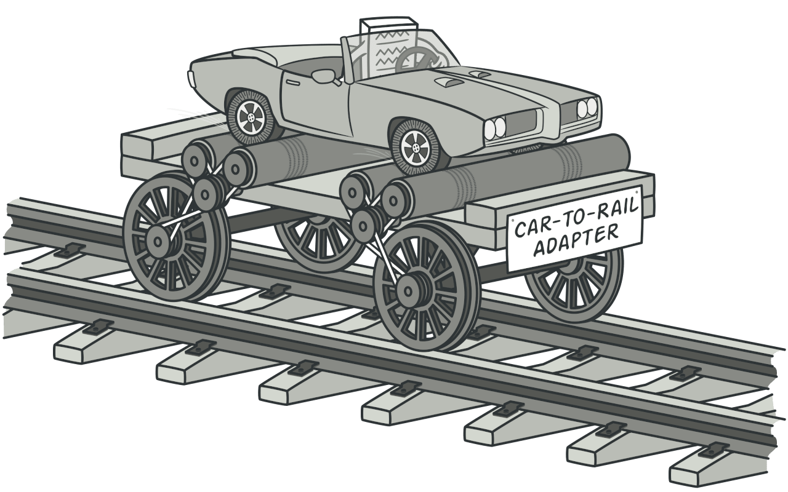
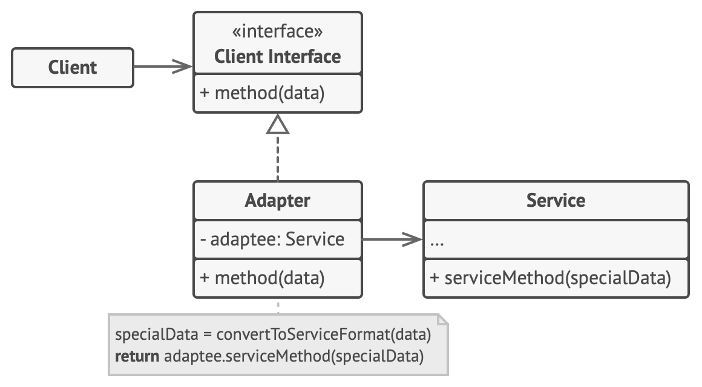
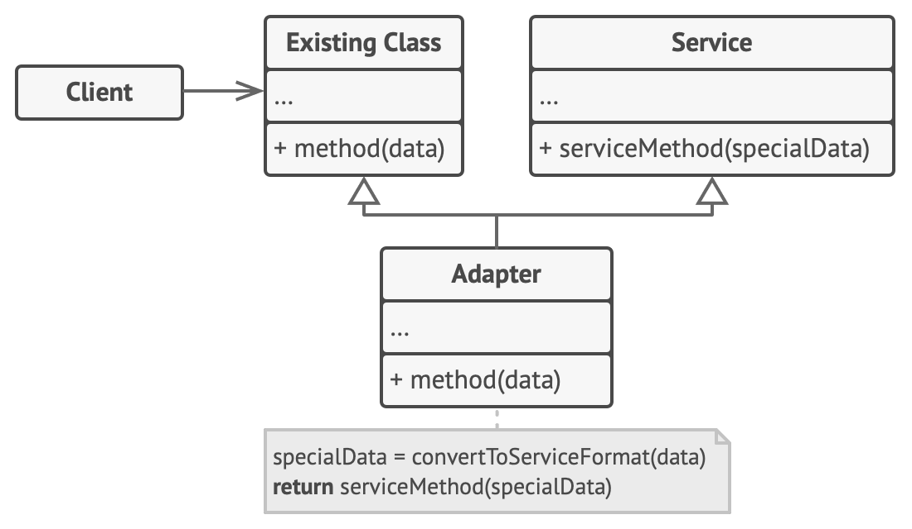

# Adapter Design Pattern
Source: [Adapter Design Pattern](https://refactoring.guru/design-patterns/adapter)

Adapter is a structural design pattern that allows objects with incompatible interfaces to collaborate.


## Problem Crux

Imagine that you’re creating a stock market monitoring app. The app downloads the stock data from multiple sources in XML format and then displays nice-looking charts and diagrams for the user.
At some point, you decide to improve the app by integrating a smart 3rd-party analytics library. But there’s a catch: the analytics library only works with data in JSON format.
You could change the library to work with XML. However, this might break some existing code that relies on the library. And worse, you might not have access to the library’s source code in the first place, making this approach impossible.

## Solution

You can create an adapter. This is a special object that converts the interface of one object so that another object can understand it.
An adapter wraps one of the objects to hide the complexity of conversion happening behind the scenes. The wrapped object isn’t even aware of the adapter. For example, you can wrap an object that operates in meters and kilometers with an adapter that converts all of the data to imperial units such as feet and miles.
Adapters can not only convert data into various formats but can also help objects with different interfaces collaborate. Here’s how it works:

 - The adapter gets an interface, compatible with one of the existing objects.
 - Using this interface, the existing object can safely call the adapter’s methods.
 - Upon receiving a call, the adapter passes the request to the second object, but in a format and order that the second object expects.

Sometimes it’s even possible to create a two-way adapter that can convert the calls in both directions.


---

## Structure


The adapter design pattern has two structure:

### 1 Object Adapter


1. The Client is a class that contains the existing business logic of the program.
2. The Client Interface describes a protocol that other classes must follow to be able to collaborate with the client code.
3. The Service is some useful class (usually 3rd-party or legacy). The client can’t use this class directly because it has an incompatible interface.
4. The Adapter is a class that’s able to work with both the client and the service: it implements the client interface, while wrapping the service object. The adapter receives calls from the client via the client interface and translates them into calls to the wrapped service object in a format it can understand.

> The client code doesn’t get coupled to the concrete adapter class as long as it works with the adapter via the client interface. Thanks to this, you can introduce new types of adapters into the program without breaking the existing client code. This can be useful when the interface of the service class gets changed or replaced: you can just create a new adapter class without changing the client code.

### 2 Class Adapter


1. The Class Adapter doesn’t need to wrap any objects because it inherits behaviors from both the client and the service. The adaptation happens within the overridden methods. The resulting adapter can be used in place of an existing client class.

> This implementation uses inheritance: the adapter inherits interfaces from both objects at the same time. Note that this approach can only be implemented in programming languages that support multiple inheritance, such as C++.

## Framwork to follow while implementing

1. Make sure that you have at least two classes with incompatible interfaces:
    - A useful service class, which you can’t change (often 3rd-party, legacy or with lots of existing dependencies).
    - One or several client classes that would benefit from using the service class.
2. Declare the client interface and describe how clients communicate with the service.
3. Create the adapter class and make it follow the client interface. Leave all the methods empty for now.
4. One by one, implement all methods of the client interface in the adapter class. The adapter should delegate most of the real work to the service object, handling only the interface or data format conversion.
5. Clients should use the adapter via the client interface. This will let you change or extend the adapters without affecting the client code.

---
## Object Adapter
```cpp
/**
 * The Target defines the domain-specific interface used by the client code.
 */
class Target {
 public:
  virtual ~Target() = default;

  virtual std::string Request() const {
    return "Target: The default target's behavior.";
  }
};

/**
 * The Adaptee contains some useful behavior, but its interface is incompatible
 * with the existing client code. The Adaptee needs some adaptation before the
 * client code can use it.
 */
class Adaptee {
 public:
  std::string SpecificRequest() const {
    return ".eetpadA eht fo roivaheb laicepS";
  }
};

/**
 * The Adapter makes the Adaptee's interface compatible with the Target's
 * interface.
 */
class Adapter : public Target {
 private:
  Adaptee *adaptee_;

 public:
  Adapter(Adaptee *adaptee) : adaptee_(adaptee) {}
  std::string Request() const override {
    std::string to_reverse = this->adaptee_->SpecificRequest();
    std::reverse(to_reverse.begin(), to_reverse.end());
    return "Adapter: (TRANSLATED) " + to_reverse;
  }
};

/**
 * The client code supports all classes that follow the Target interface.
 */
void ClientCode(const Target *target) {
  std::cout << target->Request();
}

int main() {
  std::cout << "Client: I can work just fine with the Target objects:\n";
  Target *target = new Target;
  ClientCode(target);
  std::cout << "\n\n";
  Adaptee *adaptee = new Adaptee;
  std::cout << "Client: The Adaptee class has a weird interface. See, I don't understand it:\n";
  std::cout << "Adaptee: " << adaptee->SpecificRequest();
  std::cout << "\n\n";
  std::cout << "Client: But I can work with it via the Adapter:\n";
  Adapter *adapter = new Adapter(adaptee);
  ClientCode(adapter);
  std::cout << "\n";

  delete target;
  delete adaptee;
  delete adapter;

  return 0;
}

```

```
Client: I can work just fine with the Target objects:
Target: The default target's behavior.

Client: The Adaptee class has a weird interface. See, I don't understand it:
Adaptee: .eetpadA eht fo roivaheb laicepS

Client: But I can work with it via the Adapter:
Adapter: (TRANSLATED) Special behavior of the Adaptee.
```

## Class Adapter
```cpp
/**
 * The Target defines the domain-specific interface used by the client code.
 */
class Target {
 public:
  virtual ~Target() = default;
  virtual std::string Request() const {
    return "Target: The default target's behavior.";
  }
};

/**
 * The Adaptee contains some useful behavior, but its interface is incompatible
 * with the existing client code. The Adaptee needs some adaptation before the
 * client code can use it.
 */
class Adaptee {
 public:
  std::string SpecificRequest() const {
    return ".eetpadA eht fo roivaheb laicepS";
  }
};

/**
 * The Adapter makes the Adaptee's interface compatible with the Target's
 * interface using multiple inheritance.
 */
class Adapter : public Target, public Adaptee {
 public:
  Adapter() {}
  std::string Request() const override {
    std::string to_reverse = SpecificRequest();
    std::reverse(to_reverse.begin(), to_reverse.end());
    return "Adapter: (TRANSLATED) " + to_reverse;
  }
};

/**
 * The client code supports all classes that follow the Target interface.
 */
void ClientCode(const Target *target) {
  std::cout << target->Request();
}

int main() {
  std::cout << "Client: I can work just fine with the Target objects:\n";
  Target *target = new Target;
  ClientCode(target);
  std::cout << "\n\n";
  Adaptee *adaptee = new Adaptee;
  std::cout << "Client: The Adaptee class has a weird interface. See, I don't understand it:\n";
  std::cout << "Adaptee: " << adaptee->SpecificRequest();
  std::cout << "\n\n";
  std::cout << "Client: But I can work with it via the Adapter:\n";
  Adapter *adapter = new Adapter;
  ClientCode(adapter);
  std::cout << "\n";

  delete target;
  delete adaptee;
  delete adapter;

  return 0;
}
```
```
Client: I can work just fine with the Target objects:
Target: The default target's behavior.

Client: The Adaptee class has a weird interface. See, I don't understand it:
Adaptee: .eetpadA eht fo roivaheb laicepS

Client: But I can work with it via the Adapter:
Adapter: (TRANSLATED) Special behavior of the Adaptee.

```

## Pros

 - Single Responsibility Principle. You can separate the interface or data conversion code from the primary business logic of the program.
 - Open/Closed Principle. You can introduce new types of adapters into the program without breaking the existing client code, as long as they work with the adapters through the client interface.

