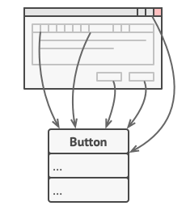
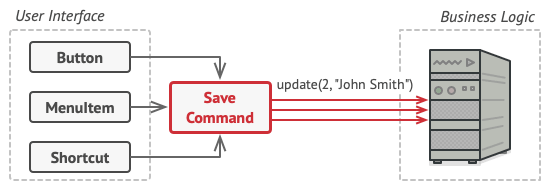
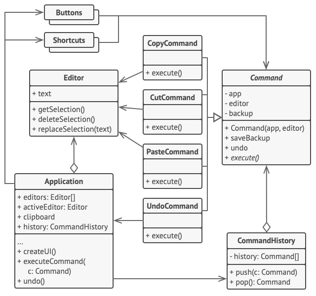

# Command Design Pattern
Source: [Command Design Pattern](https://refactoring.guru/design-patterns/command)

Command is a behavioral design pattern that turns a request into a stand-alone object that contains all information about the request. This transformation lets you pass requests as method arguments, delay or queue a request’s execution, and support undoable operations.


## Problem Crux


Imagine that you’re working on a text-editor app. You need a toolbar with many buttons for editor operations. You already have a generic `Button` class that can be reused in different parts of the UI.

All buttons look similar, but they are supposed to do different things. One straightforward option is to create many button subclasses and place each click handler directly inside them. That works for a while, but it quickly becomes messy.

Soon, the GUI code becomes tightly coupled to business logic. Even worse, the same operation may need to be triggered from multiple places: a toolbar button, a context menu, or a keyboard shortcut. If the action logic lives in specific UI classes, you either duplicate code everywhere or make unrelated UI elements depend on one another.

## Solution



The Command pattern suggests extracting every request into a separate command object. This object stores everything needed to perform the request, such as the receiver object, the method to call, and any required parameters.

Once requests become objects, UI elements no longer need to know how an operation is performed. They simply trigger a command through a common interface. The command then forwards the request to the correct receiver and handles the details.

This reduces coupling between the sender and the business logic. It also allows commands to be queued, logged, reused across multiple UI elements, and even stored in history to support undo and redo.

---

## Structure


1. The Sender class, also called the invoker, is responsible for initiating requests. It holds a reference to a command object and triggers that command instead of calling the receiver directly.
2. The Command interface usually declares a single execution method.
3. Concrete Commands implement different kinds of requests. They typically store a receiver and any context data required to perform the operation.
4. The Receiver contains the actual business logic. Commands delegate the real work to receiver objects.
5. The Client creates and configures concrete command objects. It passes receivers and all required parameters into commands and then assigns these commands to senders.

> The sender knows how to trigger a command, but it doesn’t know how the actual work is performed. The command object acts as the bridge between the sender and the receiver.

## Framwork to follow while implementing

1. Identify operations that need to be triggered from different places or need features like queuing, logging, or undo support.
2. Declare a command interface with a common execution method.
3. Create concrete command classes for each request. Store the receiver and all required data inside the command object.
4. Extract the business logic into receiver classes if it currently lives inside UI or sender classes.
5. Update sender or invoker classes so they trigger command objects instead of calling business logic directly.
6. In the client code, create the concrete commands and inject them into the appropriate senders.
7. If needed, maintain command history to support undo, redo, or audit logging.

---
## Example Structure


```cpp
#include <iostream>
#include <string>

/**
 * The Command interface declares a method for executing a command.
 */
class Command {
 public:
  virtual ~Command() {
  }
  virtual void Execute() const = 0;
};

/**
 * Some commands can implement simple operations on their own.
 */
class SimpleCommand : public Command {
 private:
  std::string pay_load_;

 public:
  explicit SimpleCommand(std::string pay_load) : pay_load_(pay_load) {
  }

  void Execute() const override {
    std::cout << "SimpleCommand: See, I can do simple things like printing (" << this->pay_load_ << ")\n";
  }
};

/**
 * The Receiver classes contain some important business logic.
 */
class Receiver {
 public:
  void DoSomething(const std::string &a) {
    std::cout << "Receiver: Working on (" << a << ".)\n";
  }

  void DoSomethingElse(const std::string &b) {
    std::cout << "Receiver: Also working on (" << b << ".)\n";
  }
};

/**
 * Some commands can delegate more complex operations to receiver objects.
 */
class ComplexCommand : public Command {
 private:
  Receiver *receiver_;
  std::string a_;
  std::string b_;

 public:
  ComplexCommand(Receiver *receiver, std::string a, std::string b)
      : receiver_(receiver), a_(a), b_(b) {
  }

  void Execute() const override {
    std::cout << "ComplexCommand: Complex stuff should be done by a receiver object.\n";
    this->receiver_->DoSomething(this->a_);
    this->receiver_->DoSomethingElse(this->b_);
  }
};

/**
 * The Invoker is associated with one or several commands.
 */
class Invoker {
 private:
  Command *on_start_{};
  Command *on_finish_{};

 public:
  ~Invoker() {
    delete on_start_;
    delete on_finish_;
  }

  void SetOnStart(Command *command) {
    this->on_start_ = command;
  }

  void SetOnFinish(Command *command) {
    this->on_finish_ = command;
  }

  void DoSomethingImportant() {
    std::cout << "Invoker: Does anybody want something done before I begin?\n";
    if (this->on_start_) {
      this->on_start_->Execute();
    }

    std::cout << "Invoker: ...doing something really important...\n";
    std::cout << "Invoker: Does anybody want something done after I finish?\n";

    if (this->on_finish_) {
      this->on_finish_->Execute();
    }
  }
};

int main() {
  Invoker *invoker = new Invoker;
  invoker->SetOnStart(new SimpleCommand("Say Hi!"));

  Receiver *receiver = new Receiver;
  invoker->SetOnFinish(new ComplexCommand(receiver, "Send email", "Save report"));

  invoker->DoSomethingImportant();

  delete invoker;
  delete receiver;

  return 0;
}
```

```text
Invoker: Does anybody want something done before I begin?
SimpleCommand: See, I can do simple things like printing (Say Hi!)
Invoker: ...doing something really important...
Invoker: Does anybody want something done after I finish?
ComplexCommand: Complex stuff should be done by a receiver object.
Receiver: Working on (Send email.)
Receiver: Also working on (Save report.)
```

## Pros

 - You can decouple classes that invoke operations from classes that perform those operations.
 - You can introduce new commands without changing existing client code.
 - You can assemble commands into complex operations.
 - You can implement undo or redo, deferred execution, logging, and command queues more easily.
