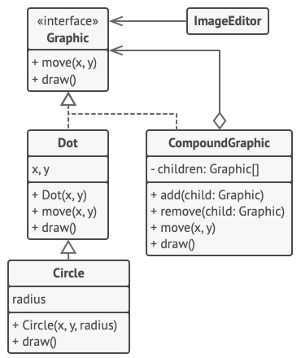

# Composite Design Pattern
Source: [Composite Design Pattern](https://refactoring.guru/design-patterns/composite)

Composite is a structural design pattern that lets you compose objects into tree structures and then work with these structures as if they were individual objects.


## Problem Crux


Using the Composite pattern makes sense only when the core model of your app can be represented as a tree.

For example, imagine that you have two types of objects: `Products` and `Boxes`. A `Box` can contain several `Products` as well as a number of smaller `Boxes`. These little `Boxes` can also hold some `Products` or even smaller `Boxes`, and so on.

Say you decide to create an ordering system that uses these classes. Orders could contain simple products without any wrapping, as well as boxes stuffed with products and other boxes. How would you determine the total price of such an order?

You could try the direct approach: unwrap all the boxes, go over all the products and then calculate the total. That would be doable in the real world, but in a program it’s not as simple as running a loop. You have to know the classes of `Products` and `Boxes` you’re going through, the nesting level of the boxes and other nasty details beforehand. All of this makes the direct approach either too awkward or even impossible.

## Solution

The Composite pattern suggests that you work with `Products` and `Boxes` through a common interface which declares a method for calculating the total price.

For a product, it would simply return the product’s price. For a box, it would go over each item the box contains, ask its price and then return a total for this box. If one of these items were a smaller box, that box would also start going over its contents and so on, until the prices of all inner components were calculated.

The greatest benefit of this approach is that you don’t need to care about the concrete classes of objects that compose the tree. You don’t need to know whether an object is a simple product or a sophisticated box. You can treat them all the same via the common interface. When you call a method, the objects themselves pass the request down the tree.

---

## Structure


1. The Component interface describes operations that are common to both simple and complex elements of the tree.
2. The Leaf is a basic element of a tree that doesn’t have sub-elements.
3. The Composite is an element that has sub-elements: leaves or other composites. A composite doesn’t know the concrete classes of its children. It works with all sub-elements only via the component interface.
4. The Client works with all elements through the component interface. As a result, the client can work in the same way with both simple and complex elements of the tree.

> Usually, leaf components end up doing most of the real work, since they don’t have anyone to delegate the work to. Upon receiving a request, a composite delegates the work to its sub-elements, processes intermediate results and then returns the final result to the client.

## Framwork to follow while implementing

1. Make sure that the core model of your app can be represented as a tree structure. Try to break it down into simple elements and containers.
2. Declare the component interface with a list of methods that make sense for both simple and complex components.
3. Create a leaf class to represent simple elements. A program may have multiple different leaf classes.
4. Create a composite class to represent complex elements. In this class, provide a collection for storing references to sub-elements.
5. Define the methods for adding and removing child elements in the composite. Keep in mind that these operations can also be declared in the component interface if you want the client to treat all elements uniformly while building the tree.

---
## Example Structure


```cpp
#include <algorithm>
#include <iostream>
#include <list>
#include <string>

/**
 * The base Component class declares common operations for both simple and
 * complex objects of a composition.
 */
class Component {
 protected:
  Component *parent_;

 public:
  virtual ~Component() {}

  void SetParent(Component *parent) {
    this->parent_ = parent;
  }

  Component *GetParent() const {
    return this->parent_;
  }

  virtual void Add(Component *component) {}
  virtual void Remove(Component *component) {}

  virtual bool IsComposite() const {
    return false;
  }

  virtual std::string Operation() const = 0;
};

/**
 * The Leaf class represents the end objects of a composition.
 */
class Leaf : public Component {
 public:
  std::string Operation() const override {
    return "Leaf";
  }
};

/**
 * The Composite class represents the complex components that may have children.
 */
class Composite : public Component {
 protected:
  std::list<Component *> children_;

 public:
  void Add(Component *component) override {
    this->children_.push_back(component);
    component->SetParent(this);
  }

  void Remove(Component *component) override {
    children_.remove(component);
    component->SetParent(nullptr);
  }

  bool IsComposite() const override {
    return true;
  }

  std::string Operation() const override {
    std::string result;
    for (const Component *c : children_) {
      if (c == children_.back()) {
        result += c->Operation();
      } else {
        result += c->Operation() + "+";
      }
    }
    return "Branch(" + result + ")";
  }
};

void ClientCode(Component *component) {
  std::cout << "RESULT: " << component->Operation();
}

void ClientCode2(Component *component1, Component *component2) {
  if (component1->IsComposite()) {
    component1->Add(component2);
  }
  std::cout << "RESULT: " << component1->Operation();
}

int main() {
  Component *simple = new Leaf;
  std::cout << "Client: I've got a simple component:\n";
  ClientCode(simple);
  std::cout << "\n\n";

  Component *tree = new Composite;
  Component *branch1 = new Composite;
  Component *leaf_1 = new Leaf;
  Component *leaf_2 = new Leaf;
  Component *leaf_3 = new Leaf;
  branch1->Add(leaf_1);
  branch1->Add(leaf_2);

  Component *branch2 = new Composite;
  branch2->Add(leaf_3);
  tree->Add(branch1);
  tree->Add(branch2);

  std::cout << "Client: Now I've got a composite tree:\n";
  ClientCode(tree);
  std::cout << "\n\n";

  std::cout << "Client: I don't need to check the components classes even when managing the tree:\n";
  ClientCode2(tree, simple);
  std::cout << "\n";

  delete simple;
  delete tree;
  delete branch1;
  delete branch2;
  delete leaf_1;
  delete leaf_2;
  delete leaf_3;

  return 0;
}
```

```
Client: I've got a simple component:
RESULT: Leaf

Client: Now I've got a composite tree:
RESULT: Branch(Branch(Leaf+Leaf)+Branch(Leaf))

Client: I don't need to check the components classes even when managing the tree:
RESULT: Branch(Branch(Leaf+Leaf)+Branch(Leaf)+Leaf)
```

## Pros

 - You can work with complex tree structures more conveniently by using polymorphism and recursion.
 - Open/Closed Principle. You can introduce new element types into the app without breaking the existing code that works with the object tree.
