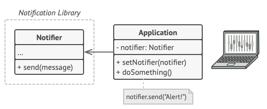
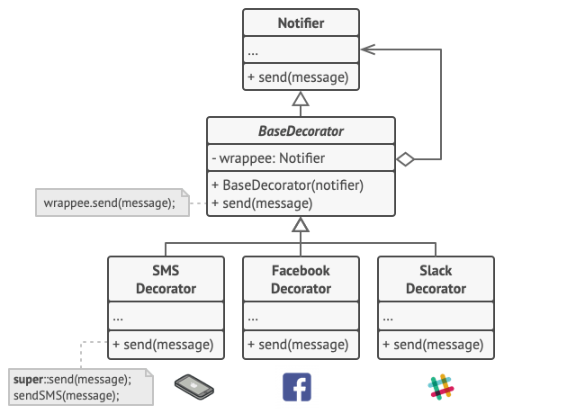

# Decorator Design Pattern
Source: [Decorator Design Pattern](https://refactoring.guru/design-patterns/decorator)


Decorator is a structural design pattern that lets you attach new behaviors to objects by placing these objects inside special wrapper objects that contain the behaviors.

## Problem Crux


Imagine that you’re working on a notification library which lets other programs notify their users about important events.

The initial version of the library was based on the `Notifier` class that had only a few fields, a constructor and a single `send` method. The method could accept a message argument from a client and send the message to a list of emails that were passed to the notifier via its constructor. A third-party app which acted as a client was supposed to create and configure the notifier object once, and then use it each time something important happened.

At some point, you realize that users of the library expect more than just email notifications. Many of them would like to receive an SMS about critical issues. Others would like to be notified on Facebook and, of course, the corporate users would love to get Slack notifications.

If you keep extending the `Notifier` with subclasses and combinations of subclasses, the number of classes grows very quickly. This leads to a combinatorial explosion and makes both the library and the client code hard to maintain.

## Solution



Instead of using inheritance to add behavior, the Decorator pattern suggests using composition. A wrapper object implements the same interface as the original object and keeps a reference to that object internally.

Because both the original object and the wrapper follow the same interface, the client can work with them in exactly the same way. The wrapper delegates the call to the wrapped object, but it may add extra behavior before or after forwarding the request.

This allows you to stack multiple decorators on top of one object. For the notification example, you can keep the base email notification logic inside the main notifier and represent SMS, Slack, or Facebook notifications as decorators. Then the client can compose the needed behavior at runtime.

---

## Structure


1. The Component declares the common interface for both wrappers and wrapped objects.
2. Concrete Component is the class of objects being wrapped. It defines the basic behavior, which can be altered by decorators.
3. The Base Decorator class has a field for referencing a wrapped object. The field’s type should be declared as the component interface so it can contain both concrete components and decorators. The base decorator delegates all operations to the wrapped object.
4. Concrete Decorators define extra behaviors that can be added to components dynamically. Concrete decorators override methods of the base decorator and execute their behavior either before or after calling the parent method.
5. The Client can wrap components in multiple layers of decorators, as long as it works with all objects via the component interface.

> The key idea is that decorators and wrapped objects share the same interface, which makes them interchangeable from the client’s point of view.

## Framwork to follow while implementing

1. Make sure your business domain can be represented as a primary component with multiple optional layers over it.
2. Figure out what methods are common to both the primary component and the optional layers. Create a component interface and declare those methods there.
3. Create a concrete component class and define the base behavior in it.
4. Create a base decorator class. It should have a field for storing a reference to a wrapped object. The field should be declared with the component interface type to allow linking to concrete components as well as decorators. The base decorator must delegate all work to the wrapped object.
5. Make sure all classes implement the component interface.
6. Create concrete decorators by extending them from the base decorator. A concrete decorator must execute its behavior before or after the call to the parent method, which delegates to the wrapped object.
7. The client code must be responsible for creating decorators and composing them in the way the client needs.

---
## Example Structure


```cpp
#include <iostream>
#include <string>

/**
 * The base Component interface defines operations that can be altered by
 * decorators.
 */
class Component {
 public:
  virtual ~Component() {}
  virtual std::string Operation() const = 0;
};

/**
 * Concrete Components provide default implementations of the operations.
 */
class ConcreteComponent : public Component {
 public:
  std::string Operation() const override {
    return "ConcreteComponent";
  }
};

/**
 * The base Decorator class follows the same interface as the other components.
 */
class Decorator : public Component {
 protected:
  Component* component_;

 public:
  Decorator(Component* component) : component_(component) {
  }

  std::string Operation() const override {
    return this->component_->Operation();
  }
};

/**
 * Concrete Decorators call the wrapped object and alter its result in some way.
 */
class ConcreteDecoratorA : public Decorator {
 public:
  ConcreteDecoratorA(Component* component) : Decorator(component) {
  }

  std::string Operation() const override {
    return "ConcreteDecoratorA(" + Decorator::Operation() + ")";
  }
};

/**
 * Decorators can execute their behavior either before or after the call to a
 * wrapped object.
 */
class ConcreteDecoratorB : public Decorator {
 public:
  ConcreteDecoratorB(Component* component) : Decorator(component) {
  }

  std::string Operation() const override {
    return "ConcreteDecoratorB(" + Decorator::Operation() + ")";
  }
};

void ClientCode(Component* component) {
  std::cout << "RESULT: " << component->Operation();
}

int main() {
  Component* simple = new ConcreteComponent;
  std::cout << "Client: I've got a simple component:\n";
  ClientCode(simple);
  std::cout << "\n\n";

  Component* decorator1 = new ConcreteDecoratorA(simple);
  Component* decorator2 = new ConcreteDecoratorB(decorator1);
  std::cout << "Client: Now I've got a decorated component:\n";
  ClientCode(decorator2);
  std::cout << "\n";

  delete simple;
  delete decorator1;
  delete decorator2;

  return 0;
}
```

```
Client: I've got a simple component:
RESULT: ConcreteComponent

Client: Now I've got a decorated component:
RESULT: ConcreteDecoratorB(ConcreteDecoratorA(ConcreteComponent))
```

## Pros

 - You can extend an object’s behavior without making a new subclass.
 - You can add or remove responsibilities from an object at runtime.
 - You can combine several behaviors by wrapping an object into multiple decorators.
 - Single Responsibility Principle. You can divide a class with many behavior variants into several smaller classes.
