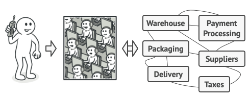
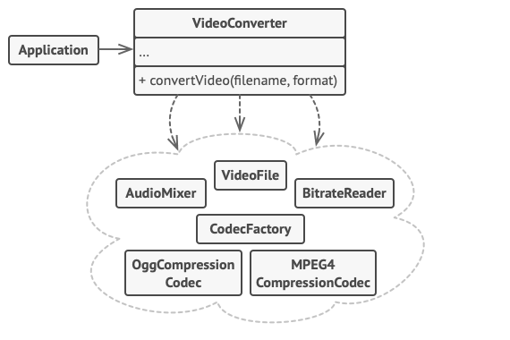

# Facade Design Pattern
Source: [Facade Design Pattern](https://refactoring.guru/design-patterns/facade)

Facade is a structural design pattern that provides a simplified interface to a library, a framework, or any other complex set of classes.


## Problem Crux


Imagine that you must make your code work with a broad set of objects that belong to a sophisticated library or framework. Ordinarily, you’d need to initialize all of those objects, keep track of dependencies, execute methods in the correct order, and so on.

As a result, the business logic of your classes would become tightly coupled to the implementation details of 3rd-party classes, making it hard to comprehend and maintain.

## Solution

A facade is a class that provides a simple interface to a complex subsystem which contains lots of moving parts. A facade might provide limited functionality in comparison to working with the subsystem directly. However, it includes only those features that clients really care about.

Having a facade is handy when you need to integrate your app with a sophisticated library that has dozens of features, but you just need a tiny bit of its functionality.

For instance, an app that uploads short funny videos with cats to social media could potentially use a professional video conversion library. However, all that it really needs is a class with the single method `encode(filename, format)`. After creating such a class and connecting it with the video conversion library, you’ll have your first facade.

---

## Structure


1. The Facade provides convenient access to a particular part of the subsystem’s functionality. It knows where to direct the client’s request and how to operate all the moving parts.
2. An Additional Facade class can be created to prevent polluting a single facade with unrelated features that might make it yet another complex structure. Additional facades can be used by both clients and other facades.
3. The Complex Subsystem consists of dozens of various objects. To make them all do something meaningful, you have to dive deep into the subsystem’s implementation details, such as initializing objects in the correct order and supplying them with data in the proper format.
4. The Client uses the facade instead of calling the subsystem objects directly.

> Subsystem classes aren’t aware of the facade’s existence. They operate within the system and work with each other directly.

## Framwork to follow while implementing

1. Check whether it’s possible to provide a simpler interface than what an existing subsystem already provides. You’re on the right track if this interface makes the client code independent from many of the subsystem’s classes.
2. Declare and implement this interface in a new facade class. The facade should redirect the calls from the client code to appropriate objects of the subsystem.
3. The facade should be responsible for initializing the subsystem and managing its further life cycle unless the client code already does this.
4. To get the full benefit from the pattern, make all the client code communicate with the subsystem only via the facade.
5. If the facade becomes too big, extract part of its behavior to a new, refined facade class.

---
## Example Structure


```cpp
#include <iostream>
#include <string>

/**
 * The Subsystem can accept requests either from the facade or client directly.
 * In any case, to the Subsystem, the Facade is yet another client, and it's not
 * a part of the Subsystem.
 */
class Subsystem1 {
 public:
  std::string Operation1() const {
    return "Subsystem1: Ready!\n";
  }

  std::string OperationN() const {
    return "Subsystem1: Go!\n";
  }
};

/**
 * Some facades can work with multiple subsystems at the same time.
 */
class Subsystem2 {
 public:
  std::string Operation1() const {
    return "Subsystem2: Get ready!\n";
  }

  std::string OperationZ() const {
    return "Subsystem2: Fire!\n";
  }
};

/**
 * The Facade class provides a simple interface to the complex logic of one or
 * several subsystems.
 */
class Facade {
 protected:
  Subsystem1 *subsystem1_;
  Subsystem2 *subsystem2_;

 public:
  Facade(Subsystem1 *subsystem1 = nullptr, Subsystem2 *subsystem2 = nullptr) {
    this->subsystem1_ = subsystem1 ? subsystem1 : new Subsystem1;
    this->subsystem2_ = subsystem2 ? subsystem2 : new Subsystem2;
  }

  ~Facade() {
    delete subsystem1_;
    delete subsystem2_;
  }

  std::string Operation() {
    std::string result = "Facade initializes subsystems:\n";
    result += this->subsystem1_->Operation1();
    result += this->subsystem2_->Operation1();
    result += "Facade orders subsystems to perform the action:\n";
    result += this->subsystem1_->OperationN();
    result += this->subsystem2_->OperationZ();
    return result;
  }
};

void ClientCode(Facade *facade) {
  std::cout << facade->Operation();
}

int main() {
  Subsystem1 *subsystem1 = new Subsystem1;
  Subsystem2 *subsystem2 = new Subsystem2;
  Facade *facade = new Facade(subsystem1, subsystem2);
  ClientCode(facade);

  delete facade;

  return 0;
}
```

```
Facade initializes subsystems:
Subsystem1: Ready!
Subsystem2: Get ready!
Facade orders subsystems to perform the action:
Subsystem1: Go!
Subsystem2: Fire!
```

## Pros

 - You can isolate your code from the complexity of a subsystem.
 - Client code becomes easier to read and maintain because it talks to one simplified interface instead of many subsystem classes.

## NOTE
 - Facade and Mediator have similar jobs: they try to organize collaboration between lots of tightly coupled classes.
 - A Facade class can often be transformed into a Singleton since a single facade object is sufficient in most cases.
 - Facade defines a new interface for existing objects, whereas Adapter tries to make the existing interface usable. Adapter usually wraps just one object, while Facade works with an entire subsystem of objects.
