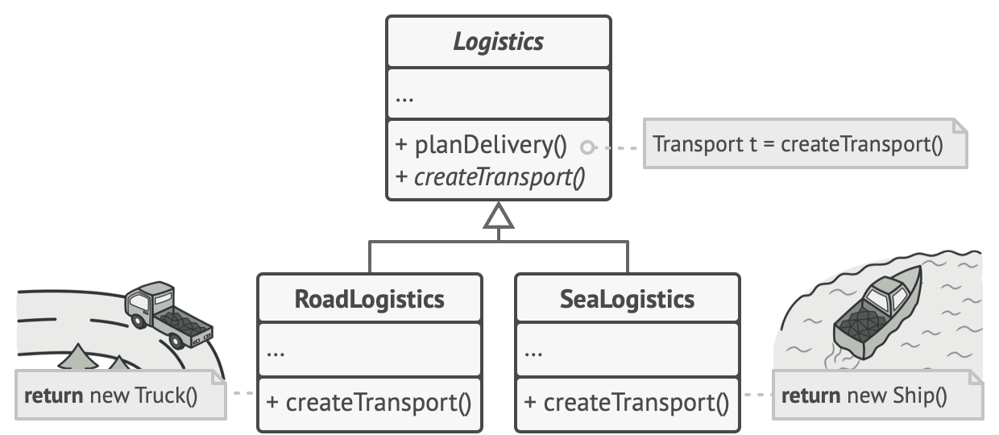
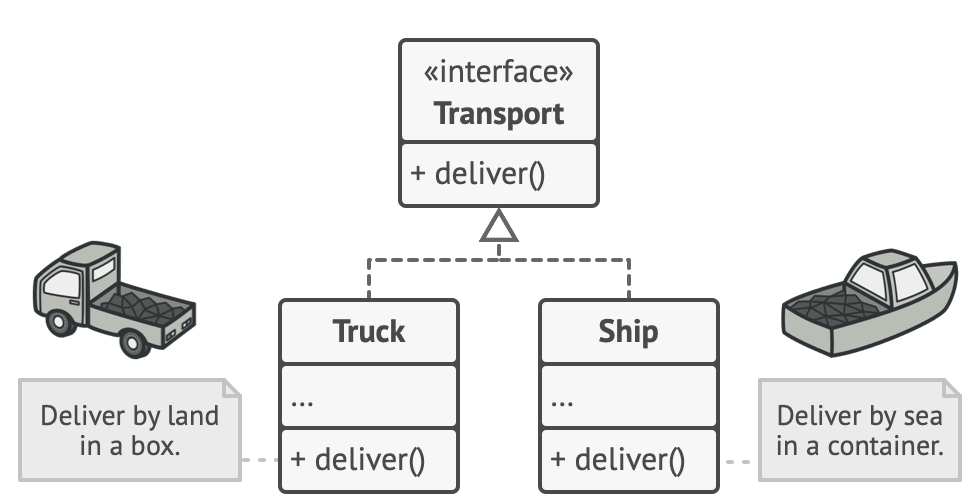
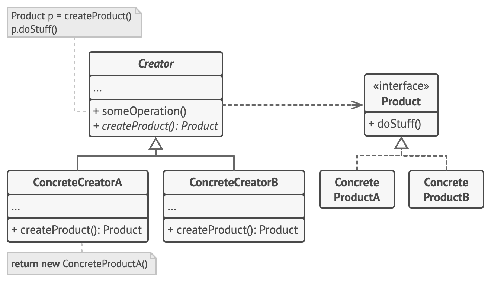

# Factory Design Pattern
Source: [Factory Design Pattern](https://refactoring.guru/design-patterns/factory-method)

Factory Method is a creational design pattern that provides an interface for creating objects in a superclass, but allows subclasses to alter the type of objects that will be created.

## Problem Crux

Imagine that you’re creating a logistics management application. The first version of your app can only handle transportation by trucks, so the bulk of your code lives inside the Truck class.

After a while, your app becomes pretty popular. Each day you receive dozens of requests from sea transportation companies to incorporate sea logistics into the app.

Great news, right? But how about the code? At present, most of your code is coupled to the Truck class. Adding Ships into the app would require making changes to the entire codebase. Moreover, if later you decide to add another type of transportation to the app, you will probably need to make all of these changes again.

As a result, you will end up with pretty nasty code, riddled with conditionals that switch the app’s behavior depending on the class of transportation objects.

## Solution

The Factory Method pattern suggests that you replace direct object construction calls (using the new operator) with calls to a special factory method. Don’t worry: the objects are still created via the new operator, but it’s being called from within the factory method. Objects returned by a factory method are often referred to as products.



At first glance, this change may look pointless: we just moved the constructor call from one part of the program to another. However, consider this: now you can override the factory method in a subclass and change the class of products being created by the method.

There’s a slight limitation though: subclasses may return different types of products only if these products have a common base class or interface. Also, the factory method in the base class should have its return type declared as this interface.



For example, both Truck and Ship classes should implement the Transport interface, which declares a method called deliver. Each class implements this method differently: trucks deliver cargo by land, ships deliver cargo by sea. The factory method in the RoadLogistics class returns truck objects, whereas the factory method in the SeaLogistics class returns ships.

The code that uses the factory method (often called the client code) doesn’t see a difference between the actual products returned by various subclasses. The client treats all the products as abstract Transport. The client knows that all transport objects are supposed to have the deliver method, but exactly how it works isn’t important to the client.

---

## Structure



This is main structure of factory design pattern.

1. The Product declares the interface, which is common to all objects that can be produced by the creator and its subclasses.
2. Concrete Products are different implementations of the product interface.
3. The Creator class declares the factory method that returns new product objects. It’s important that the return type of this method matches the product interface. You can declare the factory method as abstract to force all subclasses to implement their own versions of the method. As an alternative, the base factory method can return some default product type.
4. Concrete Creators override the base factory method so it returns a different type of product.

> Use the Factory Method when you don’t know beforehand the exact types and dependencies of the objects your code should work with.

> The Factory Method separates product construction code from the code that actually uses the product. Therefore it’s easier to extend the product construction code independently from the rest of the code.

> For example, to add a new product type to the app, you’ll only need to create a new creator subclass and override the factory method in it.

## Framwork to follow while implementing

1. Make all products follow the same interface. This interface should declare methods that make sense in every product.
2. Add an empty factory method inside the creator class. The return type of the method should match the common product interface.
3. Create a Creator base class which acts like the factory. And it has the virtual method to create product objects.
4. Now, create a set of creator subclasses for each type of product listed in the factory method. Override the factory method in the subclasses and add the implementation details according to that product.
5. Now finally the client code where it is actually used is implemented. And it takes a creator object(any one of the sub-class object depending upon use case). And the constructors and methods takes care of creating the right object of Product interface.

```cpp
/**
 * The Product interface declares the operations that all concrete products must
 * implement.
 */

class Product {
 public:
  virtual ~Product() {}
  virtual std::string Operation() const = 0;
};

/**
 * Concrete Products provide various implementations of the Product interface.
 */
class ConcreteProduct1 : public Product {
 public:
  std::string Operation() const override {
    return "{Result of the ConcreteProduct1}";
  }
};
class ConcreteProduct2 : public Product {
 public:
  std::string Operation() const override {
    return "{Result of the ConcreteProduct2}";
  }
};

/**
 * The Creator class declares the factory method that is supposed to return an
 * object of a Product class. The Creator's subclasses usually provide the
 * implementation of this method.
 */

class Creator {
  /**
   * Note that the Creator may also provide some default implementation of the
   * factory method.
   */
 public:
  virtual ~Creator(){};
  virtual Product* FactoryMethod() const = 0;
  /**
   * Also note that, despite its name, the Creator's primary responsibility is
   * not creating products. Usually, it contains some core business logic that
   * relies on Product objects, returned by the factory method. Subclasses can
   * indirectly change that business logic by overriding the factory method and
   * returning a different type of product from it.
   */

  std::string SomeOperation() const {
    // Call the factory method to create a Product object.
    Product* product = this->FactoryMethod();
    // Now, use the product.
    std::string result = "Creator: The same creator's code has just worked with " + product->Operation();
    delete product;
    return result;
  }
};

/**
 * Concrete Creators override the factory method in order to change the
 * resulting product's type.
 */
class ConcreteCreator1 : public Creator {
  /**
   * Note that the signature of the method still uses the abstract product type,
   * even though the concrete product is actually returned from the method. This
   * way the Creator can stay independent of concrete product classes.
   */
 public:
  Product* FactoryMethod() const override {
    return new ConcreteProduct1();
  }
};

class ConcreteCreator2 : public Creator {
 public:
  Product* FactoryMethod() const override {
    return new ConcreteProduct2();
  }
};

/**
 * The client code works with an instance of a concrete creator, albeit through
 * its base interface. As long as the client keeps working with the creator via
 * the base interface, you can pass it any creator's subclass.
 */
void ClientCode(const Creator& creator) {
  // ...
  std::cout << "Client: I'm not aware of the creator's class, but it still works.\n"
            << creator.SomeOperation() << std::endl;
  // ...
}

/**
 * The Application picks a creator's type depending on the configuration or
 * environment.
 */

int main() {
  std::cout << "App: Launched with the ConcreteCreator1.\n";
  Creator* creator = new ConcreteCreator1();
  ClientCode(*creator);
  std::cout << std::endl;
  std::cout << "App: Launched with the ConcreteCreator2.\n";
  Creator* creator2 = new ConcreteCreator2();
  ClientCode(*creator2);

  delete creator;
  delete creator2;
  return 0;
}
```

```
App: Launched with the ConcreteCreator1.
Client: I'm not aware of the creator's class, but it still works.
Creator: The same creator's code has just worked with {Result of the ConcreteProduct1}

App: Launched with the ConcreteCreator2.
Client: I'm not aware of the creator's class, but it still works.
Creator: The same creator's code has just worked with {Result of the ConcreteProduct2}
```
## Pros

 - You avoid tight coupling between the creator and the concrete products.
 - Single Responsibility Principle. You can move the product creation code into one place in the program, making the code easier to support.
 - Open/Closed Principle. You can introduce new types of products into the program without breaking existing client code.

