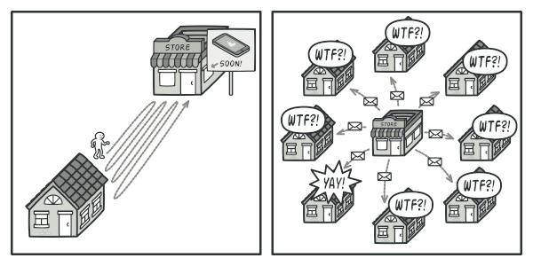
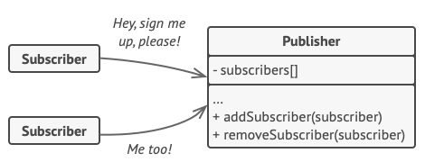
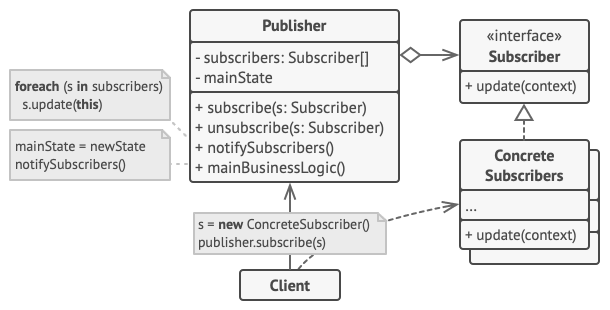
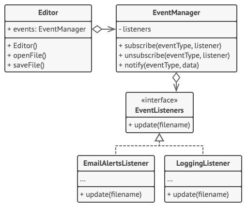

# Observer Design Pattern
Source: [Observer Design Pattern](https://refactoring.guru/design-patterns/observer)

Observer is a behavioral design pattern that lets you define a subscription mechanism to notify multiple objects about any events that happen to the object they’re observing.


## Problem Crux


Imagine that you have two types of objects: a `Customer` and a `Store`. The customer is very interested in a particular brand of product which should become available in the store very soon.

The customer could visit the store every day and check product availability. But while the product is still on the way, most of these trips would be pointless.

On the other hand, the store could send tons of emails to all customers each time a new product becomes available. This would save some customers from endless trips, but it would also bother customers who aren’t interested in that product.

This creates a conflict: either the customer wastes time checking manually, or the store wastes resources notifying the wrong people.

## Solution



The Observer pattern suggests that the object with interesting state should expose a subscription mechanism. This object is usually called the `publisher` or `subject`, and the objects interested in its changes are called `subscribers` or `observers`.

The publisher maintains a list of subscribers and provides methods to subscribe and unsubscribe. Whenever an important event happens, the publisher iterates through that list and notifies every subscriber through a common interface.

This keeps the publisher independent from concrete subscriber classes. As long as all subscribers implement the same notification interface, the publisher can work with any of them without knowing their exact type.

---

## Structure



1. The Publisher issues events of interest to other objects. It contains a subscription infrastructure that lets new subscribers join and current subscribers leave the list.
2. When a new event happens, the publisher goes over the subscription list and calls the notification method declared in the subscriber interface on each subscriber object.
3. The Subscriber interface declares the notification contract. In most cases, it consists of a single `update` method.
4. Concrete Subscribers perform some actions in response to notifications issued by the publisher. All of these classes must implement the same interface so the publisher isn’t coupled to concrete classes.
5. Usually, subscribers need some contextual information to handle the update correctly. The publisher may pass itself or event data along with the notification.
6. The Client creates publisher and subscriber objects separately and then registers subscribers for publisher updates.

> The central idea is that the publisher doesn’t know what concrete subscribers will react to its events. It only knows that they follow the same update interface.

## Framwork to follow while implementing

1. Break your business logic into two parts: the core functionality that owns the state becomes the publisher, while the reacting parts become subscribers.
2. Declare the subscriber interface. At minimum, it should define a single `update` method.
3. Declare the publisher interface with methods for adding and removing subscribers.
4. Decide where to store the subscription list and implement the subscribe or unsubscribe logic. Often this can live in a reusable base publisher class, or in a helper object if composition fits better.
5. Create concrete publisher classes. Whenever something important happens inside a publisher, it should notify all current subscribers.
6. Implement concrete subscriber classes and define how each one reacts to updates.
7. In the client code, create subscribers and register them with the appropriate publishers.

---
## Example Structure


### Pseudocode Example
```python
// The base publisher class includes subscription management
// code and notification methods.
class EventManager is
    private field listeners: hash map of event types and listeners

    method subscribe(eventType, listener) is
        listeners.add(eventType, listener)

    method unsubscribe(eventType, listener) is
        listeners.remove(eventType, listener)

    method notify(eventType, data) is
        foreach (listener in listeners.of(eventType)) do
            listener.update(data)

// The concrete publisher contains real business logic that
// interesting for some subscribers.
class Editor is
    public field events: EventManager
    private field file: File

    constructor Editor() is
        events = new EventManager()

    method openFile(path) is
        this.file = new File(path)
        events.notify("open", file.name)

    method saveFile() is
        file.write()
        events.notify("save", file.name)

// Here the subscriber interface.
interface EventListener is
    method update(filename)

class LoggingListener implements EventListener is
    private field log: File
    private field message: string

    constructor LoggingListener(log_filename, message) is
        this.log = new File(log_filename)
        this.message = message

    method update(filename) is
        log.write(replace('%s', filename, message))

class EmailAlertsListener implements EventListener is
    private field email: string
    private field message: string

    constructor EmailAlertsListener(email, message) is
        this.email = email
        this.message = message

    method update(filename) is
        system.email(email, replace('%s', filename, message))

class Application is
    method config() is
        editor = new Editor()

        logger = new LoggingListener(
            "/path/to/log.txt",
            "Someone has opened the file: %s")
        editor.events.subscribe("open", logger)

        emailAlerts = new EmailAlertsListener(
            "admin@example.com",
            "Someone has changed the file: %s")
        editor.events.subscribe("save", emailAlerts)
```

### C++ Example
```cpp
#include <iostream>
#include <list>
#include <string>

class IObserver {
 public:
  virtual ~IObserver() {}
  virtual void Update(const std::string &message_from_subject) = 0;
};

class ISubject {
 public:
  virtual ~ISubject() {};
  virtual void Attach(IObserver *observer) = 0;
  virtual void Detach(IObserver *observer) = 0;
  virtual void Notify() = 0;
};

class Subject : public ISubject {
 public:
  void Attach(IObserver *observer) override {
    list_observer_.push_back(observer);
  }

  void Detach(IObserver *observer) override {
    list_observer_.remove(observer);
  }

  void Notify() override {
    std::list<IObserver *>::iterator iterator = list_observer_.begin();
    HowManyObserver();
    while (iterator != list_observer_.end()) {
      (*iterator)->Update(message_);
      ++iterator;
    }
  }

  void CreateMessage(std::string message = "Empty") {
    this->message_ = message;
    Notify();
  }

  void HowManyObserver() {
    std::cout << "There are " << list_observer_.size() << " observers in the list.\n";
  }

 private:
  std::list<IObserver *> list_observer_;
  std::string message_;
};

class Observer : public IObserver {
 public:
  Observer(Subject &subject) : subject_(subject) {
    this->subject_.Attach(this);
    std::cout << "Hi, I'm the Observer \"" << ++Observer::static_number_ << "\".\n";
    this->number_ = Observer::static_number_;
  }

  virtual ~Observer() {
    std::cout << "Goodbye, I was the Observer \"" << this->number_ << "\".\n";
  }

  void Update(const std::string &message_from_subject) override {
    message_from_subject_ = message_from_subject;
    PrintInfo();
  }

  void RemoveMeFromTheList() {
    subject_.Detach(this);
    std::cout << "Observer \"" << number_ << "\" removed from the list.\n";
  }

  void PrintInfo() {
    std::cout << "Observer \"" << this->number_ << "\": a new message is available --> "
              << this->message_from_subject_ << "\n";
  }

 private:
  std::string message_from_subject_;
  Subject &subject_;
  static int static_number_;
  int number_;
};

int Observer::static_number_ = 0;

int main() {
  Subject *subject = new Subject;
  Observer *observer1 = new Observer(*subject);
  Observer *observer2 = new Observer(*subject);
  Observer *observer3 = new Observer(*subject);
  Observer *observer4;

  subject->CreateMessage("Hello World! :D");
  observer3->RemoveMeFromTheList();

  subject->CreateMessage("The weather is hot today! :p");
  observer4 = new Observer(*subject);

  observer2->RemoveMeFromTheList();
  observer4->RemoveMeFromTheList();

  subject->CreateMessage("My new car is great! ;)");
  observer1->RemoveMeFromTheList();

  delete observer1;
  delete observer2;
  delete observer3;
  delete observer4;
  delete subject;

  return 0;
}
```

```text
Hi, I'm the Observer "1".
Hi, I'm the Observer "2".
Hi, I'm the Observer "3".
There are 3 observers in the list.
Observer "1": a new message is available --> Hello World! :D
Observer "2": a new message is available --> Hello World! :D
Observer "3": a new message is available --> Hello World! :D
Observer "3" removed from the list.
There are 2 observers in the list.
Observer "1": a new message is available --> The weather is hot today! :p
Observer "2": a new message is available --> The weather is hot today! :p
Hi, I'm the Observer "4".
Observer "2" removed from the list.
Observer "4" removed from the list.
There are 1 observers in the list.
Observer "1": a new message is available --> My new car is great! ;)
Observer "1" removed from the list.
Goodbye, I was the Observer "1".
Goodbye, I was the Observer "2".
Goodbye, I was the Observer "3".
Goodbye, I was the Observer "4".
```

## Pros

 - Open/Closed Principle. You can introduce new subscriber classes without changing the publisher’s code.
 - You can establish relationships between objects at runtime.
 - Publishers and subscribers stay loosely coupled through common interfaces.
