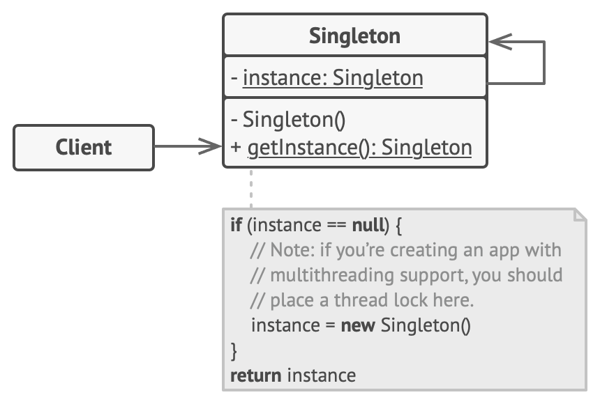

# Singleton Design Pattern
Source: [Singleton Design Pattern](https://refactoring.guru/design-patterns/singleton)

Singleton is a creational design pattern that lets you ensure that a class has only one instance, while providing a global access point to this instance.

## Problem Crux

The Singleton pattern solves two problems at the same time, violating the Single Responsibility Principle:

1. Ensure that a class has just a single instance. Why would anyone want to control how many instances a class has? The most common reason for this is to control access to some shared resource—for example, a database or a file.
Here’s how it works: imagine that you created an object, but after a while decided to create a new one. Instead of receiving a fresh object, you’ll get the one you already created.
Note that this behavior is impossible to implement with a regular constructor since a constructor call must always return a new object by design.


2. Provide a global access point to that instance. Remember those global variables that you (all right, me) used to store some essential objects? While they’re very handy, they’re also very unsafe since any code can potentially overwrite the contents of those variables and crash the app.
Just like a global variable, the Singleton pattern lets you access some object from anywhere in the program. However, it also protects that instance from being overwritten by other code.
There’s another side to this problem: you don’t want the code that solves problem #1 to be scattered all over your program. It’s much better to have it within one class, especially if the rest of your code already depends on it.


## Solution

All implementations of the Singleton have these two steps in common:

 - Make the default constructor private, to prevent other objects from using the ```new``` operator with the Singleton class.
 - Create a static creation method that acts as a constructor. Under the hood, this method calls the private constructor to create an object and saves it in a static field. All following calls to this method return the cached object.

If your code has access to the Singleton class, then it’s able to call the Singleton’s static method. So whenever that method is called, the same object is always returned.

---

## Structure



This is main structure of singleton design pattern.

1. Declare a single class for shared object as singleton.
2. make the constructor as private, it should not be accessible by any object.
3. Define ```getInstance()``` as static method and it should be the only source to get the shared resource.
4. THe logic to create a new instance of resource if it doesn't exist already or return the single one, All should be inside this method.
5. Take care of Thread safetly, because just using a static method will still allow parallel threads to access and create multiple isntance of same shared resource.

> Use the Singleton pattern when a class in your program should have just a single instance available to all clients; for example, a single database object shared by different parts of the program.

> Use the Singleton pattern when you need stricter control over global variables.

> Note that you can always adjust this limitation and allow creating any number of Singleton instances. The only piece of code that needs changing is the body of the ```getInstance``` method.

## Framwork to follow while implementing

1. Add a private static field to the class for storing the singleton instance.
2. Declare a public static creation method for getting the singleton instance.
3. Implement “lazy initialization” inside the static method. It should create a new object on its first call and put it into the static field. The method should always return that instance on all subsequent calls.
4. Make the constructor of the class private. The static method of the class will still be able to call the constructor, but not the other objects.
5. Go over the client code and replace all direct calls to the singleton’s constructor with calls to its static creation method.

---
## Naïve Singleton
```cpp
/**
 * The Singleton class defines the `GetInstance` method that serves as an
 * alternative to constructor and lets clients access the same instance of this
 * class over and over.
 */
class Singleton
{

    /**
     * The Singleton's constructor should always be private to prevent direct
     * construction calls with the `new` operator.
     */

protected:
    Singleton(const std::string value): value_(value)
    {
    }

    static Singleton* singleton_;

    std::string value_;

public:

    /**
     * Singletons should not be cloneable.
     */
    Singleton(Singleton &other) = delete;
    /**
     * Singletons should not be assignable.
     */
    void operator=(const Singleton &) = delete;
    /**
     * This is the static method that controls the access to the singleton
     * instance. On the first run, it creates a singleton object and places it
     * into the static field. On subsequent runs, it returns the client existing
     * object stored in the static field.
     */

    static Singleton *GetInstance(const std::string& value);
    /**
     * Finally, any singleton should define some business logic, which can be
     * executed on its instance.
     */
    void SomeBusinessLogic()
    {
        // ...
    }

    std::string value() const{
        return value_;
    } 
};

Singleton* Singleton::singleton_= nullptr;;

/**
 * Static methods should be defined outside the class.
 */
Singleton *Singleton::GetInstance(const std::string& value)
{
    /**
     * This is a safer way to create an instance. instance = new Singleton is
     * dangeruous in case two instance threads wants to access at the same time
     */
    if(singleton_==nullptr){
        singleton_ = new Singleton(value);
    }
    return singleton_;
}

void ThreadFoo(){
    // Following code emulates slow initialization.
    std::this_thread::sleep_for(std::chrono::milliseconds(1000));
    Singleton* singleton = Singleton::GetInstance("FOO");
    std::cout << singleton->value() << "\n";
}

void ThreadBar(){
    // Following code emulates slow initialization.
    std::this_thread::sleep_for(std::chrono::milliseconds(1000));
    Singleton* singleton = Singleton::GetInstance("BAR");
    std::cout << singleton->value() << "\n";
}


int main()
{
    std::cout <<"If you see the same value, then singleton was reused (yay!\n" <<
                "If you see different values, then 2 singletons were created (booo!!)\n\n" <<
                "RESULT:\n";   
    std::thread t1(ThreadFoo);
    std::thread t2(ThreadBar);
    t1.join();
    t2.join();

    return 0;
}
```

```
If you see the same value, then singleton was reused (yay!
If you see different values, then 2 singletons were created (booo!!)

RESULT:
BAR
FOO
```

## Thread-safe Singleton
```cpp
/**
 * The Singleton class defines the `GetInstance` method that serves as an
 * alternative to constructor and lets clients access the same instance of this
 * class over and over.
 */
class Singleton
{

    /**
     * The Singleton's constructor/destructor should always be private to
     * prevent direct construction/desctruction calls with the `new`/`delete`
     * operator.
     */
private:
    static Singleton * pinstance_;
    static std::mutex mutex_;

protected:
    Singleton(const std::string value): value_(value)
    {
    }
    ~Singleton() {}
    std::string value_;

public:
    /**
     * Singletons should not be cloneable.
     */
    Singleton(Singleton &other) = delete;
    /**
     * Singletons should not be assignable.
     */
    void operator=(const Singleton &) = delete;
    /**
     * This is the static method that controls the access to the singleton
     * instance. On the first run, it creates a singleton object and places it
     * into the static field. On subsequent runs, it returns the client existing
     * object stored in the static field.
     */

    static Singleton *GetInstance(const std::string& value);
    /**
     * Finally, any singleton should define some business logic, which can be
     * executed on its instance.
     */
    void SomeBusinessLogic()
    {
        // ...
    }
    
    std::string value() const{
        return value_;
    } 
};

/**
 * Static methods should be defined outside the class.
 */

Singleton* Singleton::pinstance_{nullptr};
std::mutex Singleton::mutex_;

/**
 * The first time we call GetInstance we will lock the storage location
 *      and then we make sure again that the variable is null and then we
 *      set the value. RU:
 */
Singleton *Singleton::GetInstance(const std::string& value)
{
    std::lock_guard<std::mutex> lock(mutex_);
    if (pinstance_ == nullptr)
    {
        pinstance_ = new Singleton(value);
    }
    return pinstance_;
}

void ThreadFoo(){
    // Following code emulates slow initialization.
    std::this_thread::sleep_for(std::chrono::milliseconds(1000));
    Singleton* singleton = Singleton::GetInstance("FOO");
    std::cout << singleton->value() << "\n";
}

void ThreadBar(){
    // Following code emulates slow initialization.
    std::this_thread::sleep_for(std::chrono::milliseconds(1000));
    Singleton* singleton = Singleton::GetInstance("BAR");
    std::cout << singleton->value() << "\n";
}

int main()
{   
    std::cout <<"If you see the same value, then singleton was reused (yay!\n" <<
                "If you see different values, then 2 singletons were created (booo!!)\n\n" <<
                "RESULT:\n";   
    std::thread t1(ThreadFoo);
    std::thread t2(ThreadBar);
    t1.join();
    t2.join();
    
    return 0;
}
```
```
If you see the same value, then singleton was reused (yay!
If you see different values, then 2 singletons were created (booo!!)

RESULT:
FOO
FOO
```


### SIDE NOTE (Inside GetINstance() we locked the mutex to set the value for instance. But we never release the lock() Why ?)
In your code, you are using std::lock_guard. Here is exactly why the lock is being released:
The Magic of ```std::lock_guard```
When you write ```std::lock_guard<std::mutex> lock(mutex_);```, you aren't just calling a function; you are creating an object on the stack named lock.

At Construction: The moment ```lock``` is created, its constructor calls ```mutex_.lock()```.

At Destruction: When the ```GetInstance``` function reaches its closing brace } (or a return statement), the lock object goes out of scope and is destroyed. Its destructor automatically calls ```mutex_.unlock()```.

> Why use this instead of manual calls?

If you were to use ```mutex_.lock()``` and ```mutex_.unlock()``` manually, your code would be "exception-unsafe." If the 
```new Singleton(value)``` line threw an error, the code would skip the manual unlock, and your program would dead-lock forever.

By using ```lock_guard```, the C++ runtime guarantees the mutex is released no matter how the function ends.

## Pros

 - You can be sure that a class has only a single instance.
 -  The singleton object is initialized only when it’s requested for the first time.

