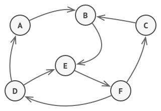
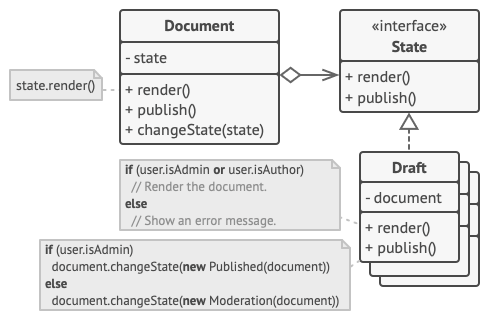
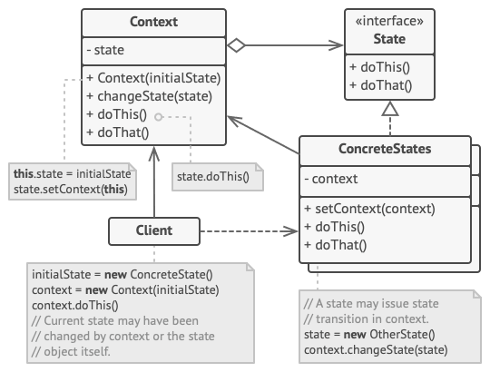
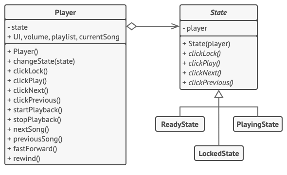

# State Design Pattern
Source: [State Design Pattern](https://refactoring.guru/design-patterns/state)

State is a behavioral design pattern that lets an object alter its behavior when its internal state changes. It appears as if the object changed its class.


## Problem Crux


The State pattern is closely related to the idea of a finite-state machine. At any given moment, an object can be in one of a limited number of states, and its behavior changes depending on which state is currently active.

Imagine a `Document` class that can be in three states: `Draft`, `Moderation`, and `Published`. The `publish` method behaves differently in each state:

- In `Draft`, it moves the document to moderation.
- In `Moderation`, it makes the document public, but only if the current user is an administrator.
- In `Published`, it does nothing.

If you implement this logic with `if` or `switch` statements spread across multiple methods, the class quickly becomes difficult to maintain. As more states and transitions are added, the conditionals grow and the code becomes harder to extend safely.

## Solution



The State pattern suggests creating separate classes for each possible state of an object and moving all state-specific behavior into those classes.

Instead of implementing every behavior directly, the original object, called the context, stores a reference to a state object representing its current state. Whenever state-dependent work is needed, the context delegates that work to the current state object.

To change behavior, the context simply switches to another state object. Since all state classes follow the same interface, the context can work with them uniformly. Unlike Strategy, concrete states often know about each other and may trigger transitions on the context.

---

## Structure



1. The Context stores a reference to one of the concrete state objects and delegates all state-specific work to it. The context communicates with the state through the common state interface.
2. The State interface declares the methods that all concrete states must implement.
3. Concrete States implement behaviors associated with a particular state of the context. They may also hold a backreference to the context so they can trigger transitions.
4. Both the context and the concrete states may switch the current state by replacing the active state object inside the context.

> The key idea is that behavior changes by switching the current state object, not by filling the context with large conditionals.

## Framwork to follow while implementing

1. Identify the class whose behavior changes according to its internal state. This class will act as the context.
2. Declare a state interface that contains only the state-specific operations.
3. Create a separate concrete state class for every real state in the system.
4. Move the state-dependent code from the context into the corresponding concrete state classes.
5. Add a reference to the current state inside the context and a method that allows switching it.
6. Replace large conditionals in the context with delegation to the current state object.
7. Let either the context or concrete states manage transitions, depending on where the transition logic fits best.

---
## Example Structure


```cpp
#include <iostream>
#include <typeinfo>

class Context;

/**
 * The base State class declares methods that all Concrete States should
 * implement and also provides a backreference to the Context object.
 */
class State {
 protected:
  Context *context_;

 public:
  virtual ~State() {
  }

  void set_context(Context *context) {
    this->context_ = context;
  }

  virtual void Handle1() = 0;
  virtual void Handle2() = 0;
};

/**
 * The Context defines the interface of interest to clients.
 */
class Context {
 private:
  State *state_;

 public:
  Context(State *state) : state_(nullptr) {
    this->TransitionTo(state);
  }

  ~Context() {
    delete state_;
  }

  void TransitionTo(State *state) {
    std::cout << "Context: Transition to " << typeid(*state).name() << ".\n";
    if (this->state_ != nullptr) {
      delete this->state_;
    }
    this->state_ = state;
    this->state_->set_context(this);
  }

  void Request1() {
    this->state_->Handle1();
  }

  void Request2() {
    this->state_->Handle2();
  }
};

class ConcreteStateA : public State {
 public:
  void Handle1() override;

  void Handle2() override {
    std::cout << "ConcreteStateA handles request2.\n";
  }
};

class ConcreteStateB : public State {
 public:
  void Handle1() override {
    std::cout << "ConcreteStateB handles request1.\n";
  }

  void Handle2() override {
    std::cout << "ConcreteStateB handles request2.\n";
    std::cout << "ConcreteStateB wants to change the state of the context.\n";
    this->context_->TransitionTo(new ConcreteStateA);
  }
};

void ConcreteStateA::Handle1() {
  std::cout << "ConcreteStateA handles request1.\n";
  std::cout << "ConcreteStateA wants to change the state of the context.\n";
  this->context_->TransitionTo(new ConcreteStateB);
}

void ClientCode() {
  Context *context = new Context(new ConcreteStateA);
  context->Request1();
  context->Request2();
  delete context;
}

int main() {
  ClientCode();
  return 0;
}
```

```text
Context: Transition to 14ConcreteStateA.
ConcreteStateA handles request1.
ConcreteStateA wants to change the state of the context.
Context: Transition to 14ConcreteStateB.
ConcreteStateB handles request2.
ConcreteStateB wants to change the state of the context.
Context: Transition to 14ConcreteStateA.
```

## Pros

 - Single Responsibility Principle. You can organize code related to particular states into separate classes.
 - Open/Closed Principle. You can introduce new states without changing existing states or the context.
 - You can simplify the context by removing large state-based conditionals.
