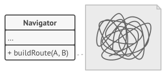
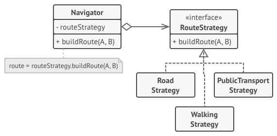
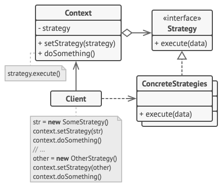

# Strategy Design Pattern
Source: [Strategy Design Pattern](https://refactoring.guru/design-patterns/strategy)

Strategy is a behavioral design pattern that lets you define a family of algorithms, put each of them into a separate class, and make their objects interchangeable.


## Problem Crux


Imagine that you are creating a navigation app for travelers. One of the most requested features is automatic route planning so users can enter an address and see the fastest route to the destination.

At first, the app supports only road routes for cars. Later, you add walking routes. After that, you add public transport. Then you want to support cyclists and tourist-friendly routes as well.

As more routing algorithms get added, the main navigator class becomes bloated. Every new algorithm adds more conditionals and more chances of breaking something that already works. Team members also end up editing the same class repeatedly, which increases merge conflicts and slows down development.

## Solution



The Strategy pattern suggests that you extract each algorithm into a separate class called a strategy. The original class, called the context, stores a reference to one of these strategies and delegates the work to it instead of implementing every variation by itself.

The context doesn’t need to know how a particular algorithm works internally. It only communicates with the strategy through a common interface. Because of this, the client can switch the active behavior at runtime by passing a different strategy object to the context.

For the navigation app, each route-building algorithm can be placed in its own class. The navigator simply asks the currently selected strategy to build the route and then renders the returned checkpoints on the map.

---

## Structure


1. The Context maintains a reference to one of the concrete strategies and communicates with this object only through the strategy interface.
2. The Strategy interface declares a method common to all supported versions of some algorithm.
3. Concrete Strategies implement different variations of the algorithm.
4. The context delegates execution to the linked strategy object whenever it needs to perform the algorithm.
5. The Client creates a concrete strategy object and passes it to the context. The context can also expose a setter so the strategy can be replaced at runtime.

> The core idea is that the context owns the workflow, while the interchangeable strategy object owns the algorithm.

## Framwork to follow while implementing

1. In the context class, identify the behavior that changes frequently or appears as a large conditional selecting between different algorithm variants.
2. Declare a strategy interface common to all algorithm variations.
3. Extract each algorithm into its own concrete strategy class.
4. Add a field in the context to store a reference to a strategy object. Let the context interact with that object only through the strategy interface.
5. Provide a way for client code to supply or replace the active strategy.
6. Update the client code so it chooses the proper strategy and injects it into the context.

---
## Example Structure


```cpp
#include <algorithm>
#include <iostream>
#include <memory>
#include <string>
#include <vector>

class Strategy {
 public:
  virtual ~Strategy() = default;
  virtual std::string DoAlgorithm(std::string_view data) const = 0;
};

class ConcreteStrategyA : public Strategy {
 public:
  std::string DoAlgorithm(std::string_view data) const override {
    std::string result(data);
    std::sort(result.begin(), result.end());
    return result;
  }
};

class ConcreteStrategyB : public Strategy {
 public:
  std::string DoAlgorithm(std::string_view data) const override {
    std::string result(data);
    std::sort(result.begin(), result.end(), std::greater<>());
    return result;
  }
};

class Context {
 private:
  std::unique_ptr<Strategy> strategy_;

 public:
  explicit Context(std::unique_ptr<Strategy> &&strategy = {}) : strategy_(std::move(strategy)) {}

  void set_strategy(std::unique_ptr<Strategy> &&strategy) {
    strategy_ = std::move(strategy);
  }

  void DoSomeBusinessLogic() const {
    if (!strategy_) {
      std::cout << "Context: strategy isn't set\n";
      return;
    }

    std::cout << "Context: Sorting data using the strategy\n";
    std::string result = strategy_->DoAlgorithm("aecbd");
    std::cout << result << "\n";
  }
};

int main() {
  Context context(std::make_unique<ConcreteStrategyA>());
  std::cout << "Client: Strategy is set to normal sorting.\n";
  context.DoSomeBusinessLogic();
  std::cout << "\n";

  std::cout << "Client: Strategy is set to reverse sorting.\n";
  context.set_strategy(std::make_unique<ConcreteStrategyB>());
  context.DoSomeBusinessLogic();

  return 0;
}
```

```text
Client: Strategy is set to normal sorting.
Context: Sorting data using the strategy
abcde

Client: Strategy is set to reverse sorting.
Context: Sorting data using the strategy
edcba
```

## Pros

 - You can swap algorithms used inside an object at runtime.
 - You can isolate the implementation details of an algorithm from the code that uses it.
 - You can replace inheritance with composition.
 - Open/Closed Principle. You can introduce new strategies without changing the context.
