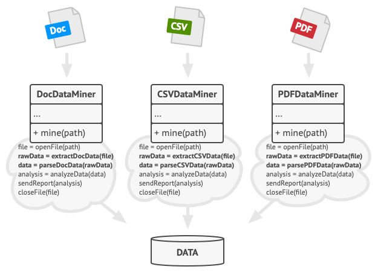
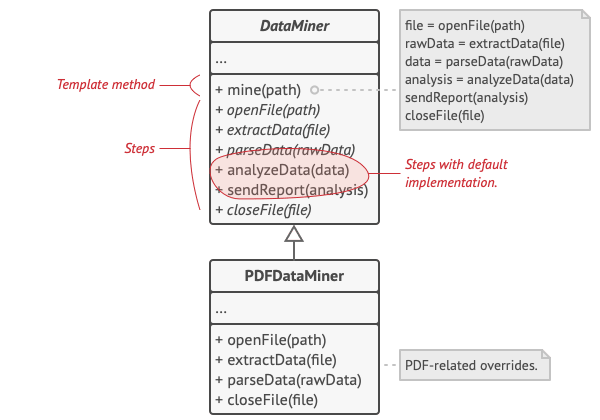
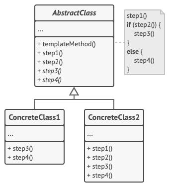
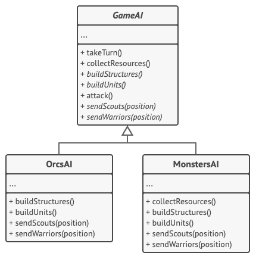

# Template Method Design Pattern
Source: [Template Method Design Pattern](https://refactoring.guru/design-patterns/template-method)

Template Method is a behavioral design pattern that defines the skeleton of an algorithm in the superclass but lets subclasses override specific steps of the algorithm without changing its structure.


## Problem Crux


Imagine that you’re building a data mining application that analyzes corporate documents. Users can provide files in multiple formats such as `PDF`, `DOC`, and `CSV`, but the app should still extract useful data in a uniform way.

At first, each file format gets its own processing class. Over time, you notice that these classes contain a lot of duplicate logic. While steps like opening files and parsing raw content differ by format, other steps such as analyzing the extracted data and generating reports are nearly identical.

There is another issue as well: the client code often ends up with conditionals that choose the correct processing class based on file type. This makes the code harder to maintain and harder to extend when a new document format is introduced.

## Solution



The Template Method pattern suggests breaking an algorithm into a series of steps, turning those steps into methods, and then placing the sequence of these method calls inside a single template method.

The superclass defines the overall algorithm structure. Some steps are declared abstract and must be implemented by subclasses. Other steps may have a default implementation in the base class, which subclasses can reuse or override. Hooks can also be provided as optional extension points with empty default behavior.

This approach removes duplicated code, preserves the algorithm’s structure in one place, and still allows subclasses to customize specific parts of the workflow.

---

## Structure



1. The Abstract Class declares methods that act as steps of an algorithm, along with the template method that calls these steps in a specific order.
2. Some of these steps may be abstract, while others may have default implementations in the base class.
3. Concrete Classes implement the abstract steps and may override optional ones, but they should not change the template method itself.

> The key idea is that the superclass controls the algorithm’s skeleton, while subclasses customize only selected steps.

## Framwork to follow while implementing

1. Analyze the target algorithm and break it into a sequence of smaller steps.
2. Identify which steps are common across all variants and which must differ in subclasses.
3. Create an abstract base class and add the template method that calls the steps in the required order.
4. Move shared logic into concrete methods in the base class.
5. Declare variable parts as abstract methods so subclasses must implement them.
6. Add optional hooks where subclasses may customize the flow without changing the template structure.
7. Create concrete subclasses for each variation of the algorithm and implement or override only the needed steps.

---
## Example Structure


```cpp
#include <iostream>

/**
 * The Abstract Class defines a template method that contains a skeleton of some
 * algorithm, composed of calls to primitive operations.
 */
class AbstractClass {
 public:
  void TemplateMethod() const {
    this->BaseOperation1();
    this->RequiredOperations1();
    this->BaseOperation2();
    this->Hook1();
    this->RequiredOperation2();
    this->BaseOperation3();
    this->Hook2();
  }

 protected:
  void BaseOperation1() const {
    std::cout << "AbstractClass says: I am doing the bulk of the work\n";
  }

  void BaseOperation2() const {
    std::cout << "AbstractClass says: But I let subclasses override some operations\n";
  }

  void BaseOperation3() const {
    std::cout << "AbstractClass says: But I am doing the bulk of the work anyway\n";
  }

  virtual void RequiredOperations1() const = 0;
  virtual void RequiredOperation2() const = 0;

  virtual void Hook1() const {
  }

  virtual void Hook2() const {
  }
};

class ConcreteClass1 : public AbstractClass {
 protected:
  void RequiredOperations1() const override {
    std::cout << "ConcreteClass1 says: Implemented Operation1\n";
  }

  void RequiredOperation2() const override {
    std::cout << "ConcreteClass1 says: Implemented Operation2\n";
  }
};

class ConcreteClass2 : public AbstractClass {
 protected:
  void RequiredOperations1() const override {
    std::cout << "ConcreteClass2 says: Implemented Operation1\n";
  }

  void RequiredOperation2() const override {
    std::cout << "ConcreteClass2 says: Implemented Operation2\n";
  }

  void Hook1() const override {
    std::cout << "ConcreteClass2 says: Overridden Hook1\n";
  }
};

void ClientCode(AbstractClass *class_) {
  class_->TemplateMethod();
}

int main() {
  std::cout << "Same client code can work with different subclasses:\n";
  ConcreteClass1 *concreteClass1 = new ConcreteClass1;
  ClientCode(concreteClass1);
  std::cout << "\n";

  std::cout << "Same client code can work with different subclasses:\n";
  ConcreteClass2 *concreteClass2 = new ConcreteClass2;
  ClientCode(concreteClass2);

  delete concreteClass1;
  delete concreteClass2;

  return 0;
}
```

```text
Same client code can work with different subclasses:
AbstractClass says: I am doing the bulk of the work
ConcreteClass1 says: Implemented Operation1
AbstractClass says: But I let subclasses override some operations
ConcreteClass1 says: Implemented Operation2
AbstractClass says: But I am doing the bulk of the work anyway

Same client code can work with different subclasses:
AbstractClass says: I am doing the bulk of the work
ConcreteClass2 says: Implemented Operation1
AbstractClass says: But I let subclasses override some operations
ConcreteClass2 says: Overridden Hook1
ConcreteClass2 says: Implemented Operation2
AbstractClass says: But I am doing the bulk of the work anyway
```

## Pros

 - You can let subclasses override only specific parts of a large algorithm.
 - You can pull duplicate code into a common superclass.
 - You keep the overall algorithm structure consistent across multiple implementations.
